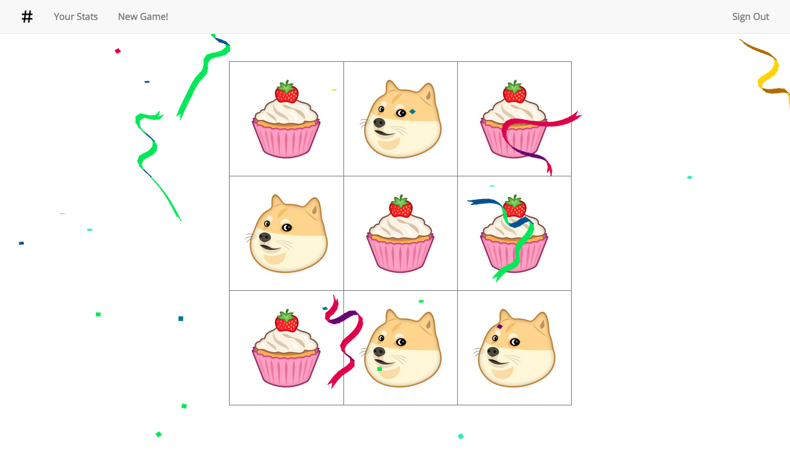

###Built with:

* Ruby
* Rails 4.1.6
* JQuery / AJAX
* Websocket Rails

###Steps to Run:

* git clone https://github.com/cameronjacoby/tic_tac_toe.git
* cd tic_tac_toe
* bundle install
* rake db:create
* rake db:migrate
* Add FACEBOOK_APP_ID and FACEBOOK_SECRET to application.yml
* Start rails server

The best way to run the application is to open http://localhost:3000 in two different browsers. Create different accounts in each browser, and your two accounts can play each other in real-time!

--------------------

